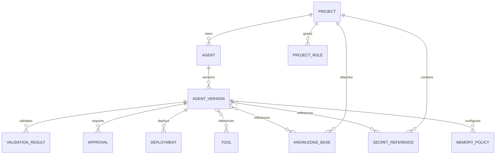

# Agent Registry Model

## Purpose

The Agent Registry is the source of truth for agent identity, ownership, lifecycle, validation, approval, deployment, and runtime policy. It must support multiple agent frameworks through one normalized model.

Supported initial agent types:

- Bedrock AgentCore native agents.
- LangGraph agents.
- ChatGPT/OpenAI agents.
- CrewAI agents.
- Strands agents.
- Future custom runtime agents.

## Core Entity Model



## Agent

Represents a logical agent across versions.

| Field | Description |
| --- | --- |
| id | Stable Guardian agent id |
| projectId | Owning project |
| name | Display name |
| description | Business description |
| ownerUserId | Primary owner |
| businessUnit | Owning business unit |
| currentVersionId | Latest submitted version |
| currentApprovedVersionId | Latest approved version |
| status | active, suspended, retired |
| createdAt | Creation timestamp |
| updatedAt | Last update timestamp |

## Agent Version

Represents an immutable submitted version.

| Field | Description |
| --- | --- |
| id | Version id |
| agentId | Parent agent |
| semanticVersion | Human version, for example 1.2.0 |
| specHash | SHA-256 hash of portable spec |
| lifecycleState | draft, submitted, security_review, business_owner_review, platform_admin_review, approved, deployed, suspended, retired, revoked |
| agentType | bedrock_agentcore, langgraph, openai_agent, crewai, strands, custom |
| runtimeTarget | agentcore, external, future |
| modelProvider | bedrock, openai, anthropic, other |
| modelId | Model identifier |
| systemInstructionsRef | Reference to stored prompt/instructions |
| toolRefs | Approved tool references requested by spec |
| knowledgeRefs | Knowledge-base references requested by spec |
| secretRefs | Secret references requested by spec |
| memoryPolicyRef | Memory configuration |
| riskTier | low, medium, high, critical |
| validationSummary | Pass/fail and warnings |
| approvalSummary | Current approval status |
| deploymentSummary | Current deployment status |
| createdBy | User that submitted version |
| createdAt | Creation timestamp |

## Portable Agent Specification

The portable spec keeps the control plane runtime-agnostic while allowing runtime-specific extensions.

```yaml
schemaVersion: guardian.agent/v1
id: claims-assistant
name: Claims Assistant
description: Assists claim specialists with claim lookup and policy guidance.
projectId: claims-operations
owner:
  userId: user-123
  businessUnit: claims
agentType: crewai
runtime:
  target: agentcore
  entrypoint: s3://guardian-artifacts/claims-assistant/1.0.0/package.zip
model:
  provider: bedrock
  modelId: anthropic.claude-3-5-sonnet
tools:
  - toolId: claim_lookup
    version: 1.0.0
    requiredScopes:
      - claims.read
knowledge:
  - knowledgeBaseId: claims-policy-kb
memory:
  shortTerm: true
  longTerm: false
secrets:
  - secretRef: apigee-claims-client
    usage: tool_auth
observability:
  arizeProject: guardian-claims
  traceLevel: standard
extensions:
  crewai:
    crewName: claims_intake_crew
    agents:
      - claim_researcher
      - policy_summarizer
  strands:
    agentName: claims_agent
    entrypoint: src/agent.py
```

## Validation Results

Each validation result is immutable and attached to an agent version.

| Field | Description |
| --- | --- |
| id | Validation run id |
| agentVersionId | Validated version |
| validationType | schema, policy, tool, kb, secret, memory, runtime, network, sandbox |
| status | pass, warn, fail |
| severity | info, low, medium, high, critical |
| message | Human-readable result |
| evidence | JSON details |
| createdAt | Timestamp |

## Approval Records

Approval is version-specific.

| Field | Description |
| --- | --- |
| id | Approval id |
| agentVersionId | Agent version |
| approverType | project_owner, platform_admin, security |
| approverUserId | Approver |
| decision | approved, rejected, revoked |
| comments | Review comment |
| decidedAt | Decision timestamp |

## Deployment Records

| Field | Description |
| --- | --- |
| id | Deployment id |
| agentVersionId | Deployed version |
| environment | dev, test, preprod, prod |
| runtime | agentcore |
| runtimeAgentId | AgentCore Runtime id |
| gatewayConfigId | AgentCore Gateway mapping id |
| policySnapshotId | Runtime policy snapshot |
| status | deploying, deployed, failed, suspended, retired |
| deployedBy | User or service |
| deployedAt | Timestamp |

## Tool Catalog

Tools should have their own lifecycle and risk profile.

| Field | Description |
| --- | --- |
| id | Tool id |
| name | Tool name |
| owner | Platform or BU owner |
| gatewayProvider | agentcore_gateway |
| apiProvider | apigee, lambda, private_api |
| version | Tool contract version |
| riskTier | low, medium, high, critical |
| allowedProjects | Project ids allowed to request tool |
| allowedScopes | API scopes |
| authMode | delegated_user, service_credential, mixed |
| rateLimit | Runtime rate limit |
| auditLevel | standard, enhanced |
| status | draft, approved, deprecated |

## Secret Reference

| Field | Description |
| --- | --- |
| id | Guardian secret reference id |
| projectId | Owning project |
| provider | secrets_manager, ssm_parameter |
| arn | AWS ARN |
| kmsKeyId | KMS key id |
| allowedAgents | Agent ids or version ids |
| allowedTools | Tool ids |
| environment | dev, test, preprod, prod |
| rotationPolicy | Rotation metadata |
| status | active, expired, revoked |

## Lifecycle Invariants

- A deployed version must be immutable.
- A version cannot be deployed unless all required approvals are approved.
- A version cannot be deployed if validation has high or critical failures.
- Tool, knowledge-base, and secret references must resolve in the current project.
- Runtime policy snapshots must be tied to a specific agent version and deployment.
- Approval revocation must block new invocations or trigger runtime suspension.
