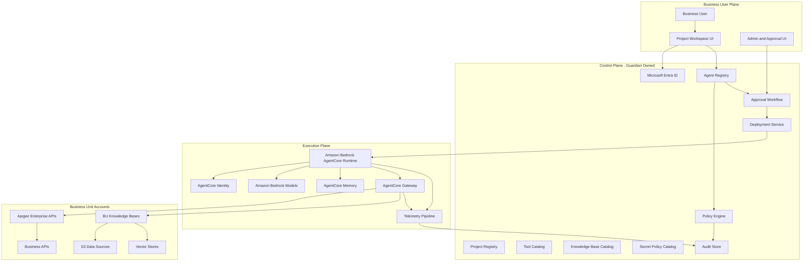
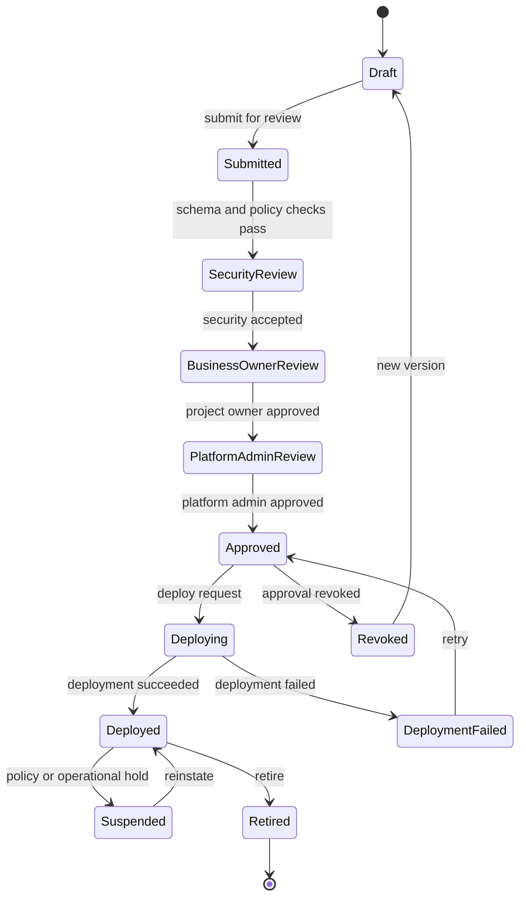
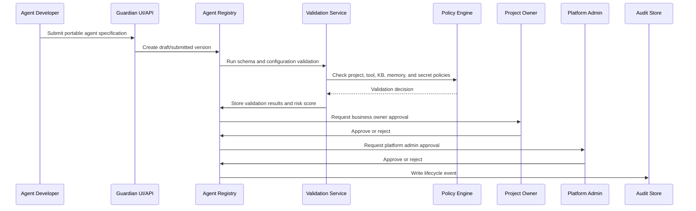
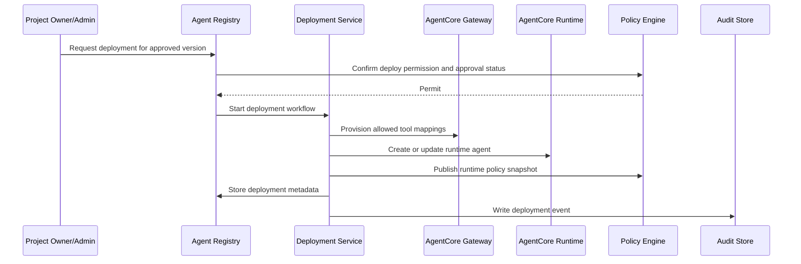
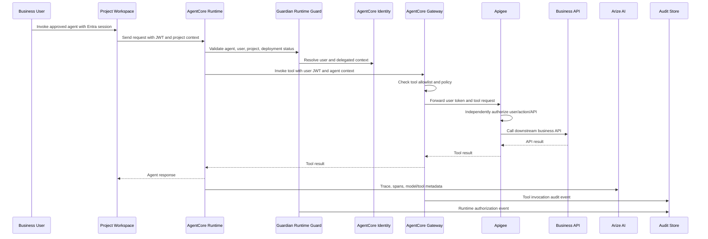

# Guardian AI Platform Architecture

## Purpose

Guardian AI Platform is an enterprise AI agent platform for bringing agentic workloads into production with centralized governance, decentralized business-unit data ownership, and consistent runtime enforcement.

The platform has three primary planes:

- Control plane: where agents, projects, tools, knowledge bases, secrets, policies, approvals, deployments, and audit records are governed.
- Execution plane: where approved agents run through Amazon Bedrock AgentCore Runtime, invoke tools through AgentCore Gateway, retrieve knowledge, use memory, and emit telemetry.
- Business user plane: where project users discover, run, and manage approved agents within project boundaries.

## Architecture Principles

- Centralize governance, decentralize data ownership.
- Use a normalized agent registry model across Bedrock AgentCore, LangGraph, ChatGPT/OpenAI agents, and future runtimes.
- Treat projects as security and ownership boundaries.
- Enforce authorization independently at each layer.
- Propagate user identity end-to-end whenever an agent acts on behalf of a user.
- Keep Guardian registries as the source of truth, even when AgentCore services perform runtime functions.
- Store secret references and policies in Guardian, never raw secret values.
- Make every lifecycle transition and runtime decision auditable.

## High-Level Planes

## AWS Service Mapping

| Area | Recommended Services |
| --- | --- |
| Web/API entry | Amazon API Gateway, Application Load Balancer, AWS WAF |
| Control services | FastAPI on ECS/EKS or Lambda, Step Functions for approvals and deployments |
| Registry storage | Aurora PostgreSQL for relational lifecycle data, DynamoDB for high-volume event/status lookup if needed |
| Authorization | Amazon Verified Permissions/Cedar plus local policy adapters |
| Secrets | AWS Secrets Manager for sensitive credentials, AWS KMS customer-managed keys, SSM Parameter Store for non-sensitive config |
| Runtime | Amazon Bedrock AgentCore Runtime |
| Identity delegation | AgentCore Identity plus Guardian JWT validation and policy context |
| Tools | AgentCore Gateway backed by Guardian Tool Catalog and Apigee |
| Knowledge | Bedrock Knowledge Bases, OpenSearch/vector stores, S3 in BU accounts |
| Networking | VPC Lattice, PrivateLink, private API Gateway endpoints, cross-account IAM roles |
| Observability | OpenTelemetry, CloudWatch, X-Ray, Arize AI |
| Audit | S3 immutable archive, Aurora/DynamoDB audit index, CloudWatch logs |

## Agent Lifecycle

## Registration And Approval Flow

## Deployment Flow

## Runtime Execution Flow

## Identity And Authorization

The preferred model is delegated user execution. The agent acts strictly on behalf of the logged-in user unless a specific service-level exception is approved.

Identity path:

1. User authenticates through Microsoft Entra ID.
2. Guardian receives and validates a JWT.
3. Guardian attaches project, role, agent, and policy context.
4. AgentCore Runtime receives the request with user and project context.
5. AgentCore Identity validates or resolves the delegated identity context.
6. AgentCore Gateway forwards the user token or a validated delegated token to Apigee.
7. Apigee and downstream APIs authorize independently.

Authorization must be layered:

- UI/API checks project role and action.
- Registry checks lifecycle and approval state.
- Runtime guard checks agent deployment eligibility.
- AgentCore Gateway checks tool allowlists and tool policy.
- Apigee checks API scopes and business authorization.
- Business APIs enforce domain-specific permissions.

## Knowledge Base Governance

Knowledge bases are business-unit owned and project attached. Agents may use only knowledge bases explicitly attached to the current project by a project owner.

Recommended pattern:

- Business units own source data, vector stores, and ingestion permissions.
- Guardian owns the catalog, attachment workflow, and access policy metadata.
- Project owners request or approve KB attachment.
- Runtime retrieval includes user, project, agent, and KB policy context.

## Memory Governance

Memory is enabled per agent version as part of the submitted agent specification and approved lifecycle.

Recommended scopes:

- Short-term memory: per user, per session, per agent, per project.
- Long-term memory: per user, per agent, per project, with explicit retention and deletion policy.
- Shared project memory: disabled by default and requires separate approval.

Memory policy must define retention, PII handling, visibility, export/delete behavior, and whether memory can be used across projects.

## Observability And Audit

Arize AI should be used for agent observability, prompt/model/tool traces, evaluation feedback, and production quality monitoring. It should complement, not replace, platform audit.

Telemetry layers:

- AgentCore Runtime spans.
- Model invocation metadata.
- Tool invocation spans from AgentCore Gateway.
- Apigee/API traces.
- Policy decision events.
- Registry lifecycle events.
- User/project/action audit records.

Audit records must be immutable enough for compliance review and searchable enough for operations.

## AgentCore Gateway Positioning

AgentCore Gateway is a strong fit for runtime tool exposure and enforcement, especially where Bedrock AgentCore is the execution standard.

Known planning risks:

- Tool governance can become vendor-coupled if Guardian does not maintain its own Tool Catalog.
- Policy duplication can emerge across Guardian, AgentCore Gateway, Apigee, and business APIs.
- Tool contract/version drift can break agents after approval.
- Runtime portability may suffer if portable agent specs are not kept independent.
- Feature limits for AgentCore Identity/Gateway should be validated before hard implementation commitments.

Recommended stance: use AgentCore Gateway as the execution-plane tool gateway, while Guardian remains the source of truth for tool registration, ownership, risk, approval, and allowed usage.

