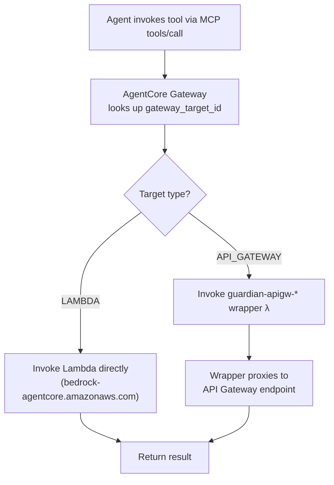
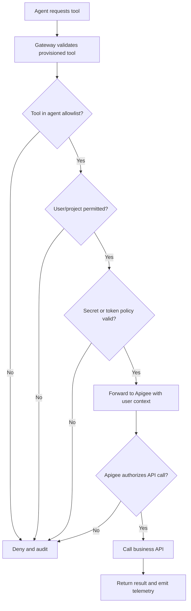

# Runtime Governance Model

> **Implementation note:** The full runtime guard, policy snapshot, and Apigee integration described below are aspirational. The current implementation uses the mock AgentCore provider (in-process MCP) in `mock` mode and real `InvokeAgentRuntimeCommand` in `dev` mode. Tool invocation reaches the AgentCore Gateway → registered Lambda/wrapper target directly — there is no Apigee proxy layer yet. The authorization layers section below is accurate for the planned production architecture.

## Purpose

Runtime governance ensures that approved agents remain constrained during execution. Approval is necessary but not sufficient. Every invocation should be checked against current user, project, agent, deployment, tool, knowledge, memory, and secret policies.

## Runtime Guard

The runtime guard is a Guardian enforcement component that can run as a service, middleware, or policy adapter around AgentCore Runtime.

Responsibilities:

- Validate user JWT and project context.
- Confirm agent is approved and deployed for the requested environment.
- Confirm user can run the agent in the project.
- Load the deployment policy snapshot.
- Enforce memory and knowledge-base constraints.
- Attach policy context to tool calls.
- Emit audit and telemetry events.

## Runtime Decision Context

```json
{
  "user": {
    "id": "user-123",
    "entraTenant": "tenant-id",
    "groups": ["claims-users"]
  },
  "project": {
    "id": "claims-operations",
    "role": "business_user"
  },
  "agent": {
    "id": "claims-assistant",
    "version": "1.0.0",
    "deploymentId": "deploy-456",
    "riskTier": "medium"
  },
  "request": {
    "environment": "prod",
    "action": "invoke_agent",
    "sessionId": "session-789"
  }
}
```

## Authorization Layers

| Layer | Enforcement |
| --- | --- |
| Guardian UI/API | User can access project and initiate action |
| Agent Registry | Agent lifecycle and deployment eligibility |
| Runtime Guard | Per-invocation user/project/agent decision |
| AgentCore Identity | Delegated identity validation and credential mediation |
| AgentCore Gateway | Tool allowlist, tool policy, routing, rate limit |
| Apigee | API OAuth/JWT validation, scopes, enterprise API policy |
| Business API | Domain-specific access control |
| Data/KB layer | Project and user-scoped retrieval permissions |

## Policy Snapshot

At deployment time, Guardian should publish a runtime policy snapshot. This prevents runtime availability from depending on multiple live control-plane reads while still keeping deployments auditable.

Snapshot contents:

- Agent version and spec hash.
- Environment.
- Allowed tools and versions.
- Tool risk tiers and rate limits.
- Allowed knowledge bases.
- Memory policy.
- Secret reference ids, not values.
- Required user roles.
- Approval record ids.
- Policy engine version.

Runtime should also support emergency deny checks for revoked agents, suspended deployments, or compromised tools.

## Tool Invocation Enforcement

### As Implemented (current build)



Lambda targets are registered via `CreateGatewayTargetCommand`. The wrapper Lambda for API Gateway tools is deployed by `wrapper-deployer.cjs` using a pure Node.js ZIP implementation (no system `zip` binary required). Permission granted via `addLambdaInvokePermission` with principal `bedrock-agentcore.amazonaws.com`.

### Aspirational (planned — Apigee integration)



## Knowledge Retrieval Enforcement

Knowledge retrieval must require:

- Agent version is allowed to use the KB.
- KB is attached to the current project.
- User is allowed to retrieve from the KB for the current action.
- Retrieval query and result metadata are auditable.
- Cross-BU access requires explicit project-owner and BU-owner approval.

## Memory Enforcement

Memory use must require:

- Memory mode enabled in the approved agent version.
- Memory scope matches user, project, and agent.
- Long-term memory has retention and deletion policy.
- Sensitive data handling is defined.
- Memory reads and writes are traced and auditable.

## Secret Enforcement

Runtime components should retrieve secrets only when:

- The secret reference belongs to the current project.
- The current agent version is allowed to use it.
- The current tool/API use is allowed.
- The environment matches.
- KMS decrypt permissions are available only to the runtime role that needs them.

## Audit Events

Minimum audit events:

- agent.submitted
- agent.validation.completed
- agent.approval.requested
- agent.approval.decided
- agent.deployment.started
- agent.deployment.completed
- agent.invocation.started
- agent.invocation.denied
- agent.invocation.completed
- tool.invocation.started
- tool.invocation.denied
- tool.invocation.completed
- kb.retrieval.started
- kb.retrieval.completed
- memory.read
- memory.write
- secret.access.requested
- secret.access.denied
- secret.access.granted

## Arize AI Observability

Arize AI should receive traces that help platform and project owners inspect:

- Prompt and response metadata.
- Model latency, token usage, and cost.
- Tool call sequence and failures.
- Retrieval context and quality signals.
- User feedback.
- Evaluation scores over time.
- Agent version regressions.

Sensitive payload capture must be governed by project and data policies.

## Failure Modes

| Failure | Expected Behavior |
| --- | --- |
| JWT invalid | Deny before runtime execution |
| Agent not approved | Deny before model invocation |
| Deployment suspended | Deny and show operational status |
| Tool not allowlisted | Gateway deny and audit |
| Apigee denies | Return safe tool failure to agent and audit |
| KB not attached | Retrieval deny |
| Secret revoked | Tool auth deny |
| Arize unavailable | Continue execution if audit path is healthy; buffer telemetry if possible |
| Audit unavailable | Fail closed for production unless break-glass mode is active |

